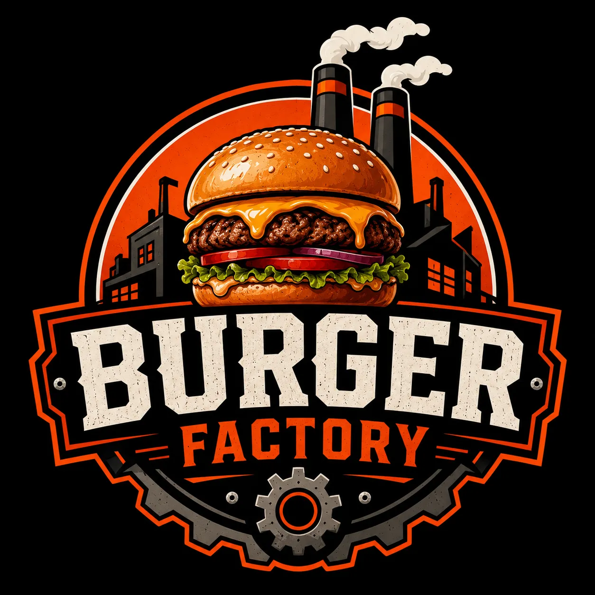
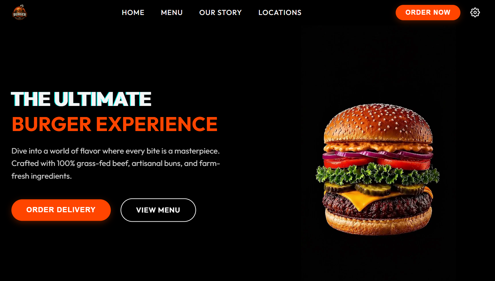
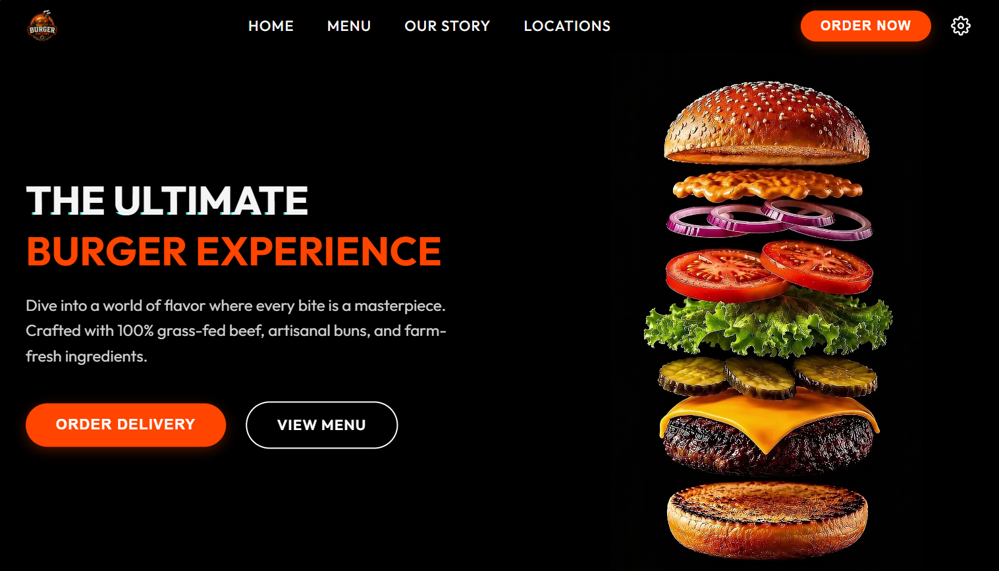
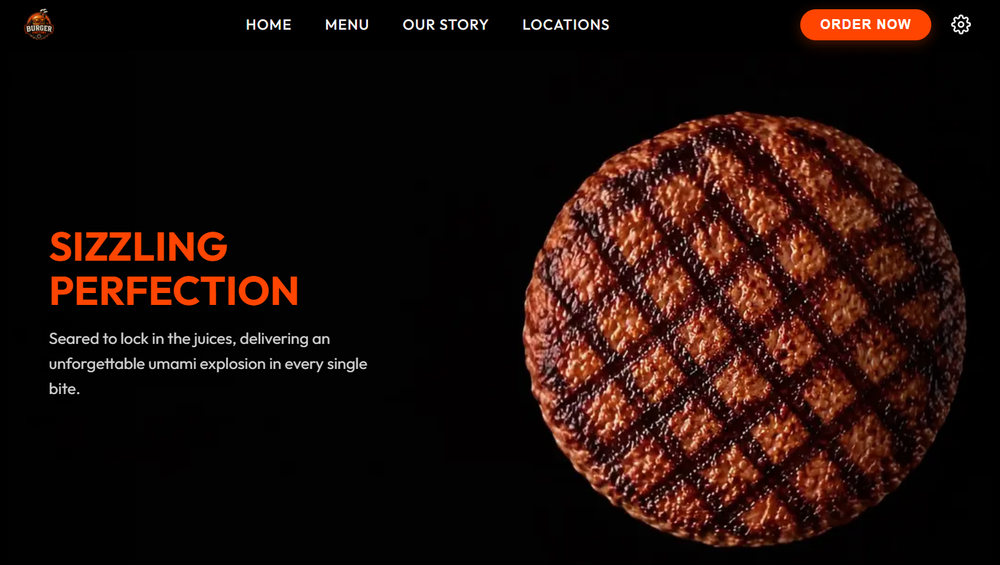
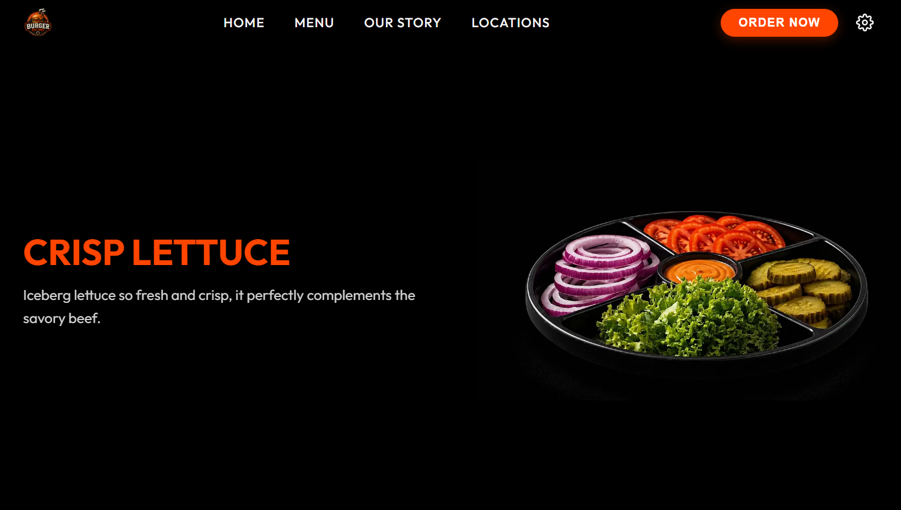
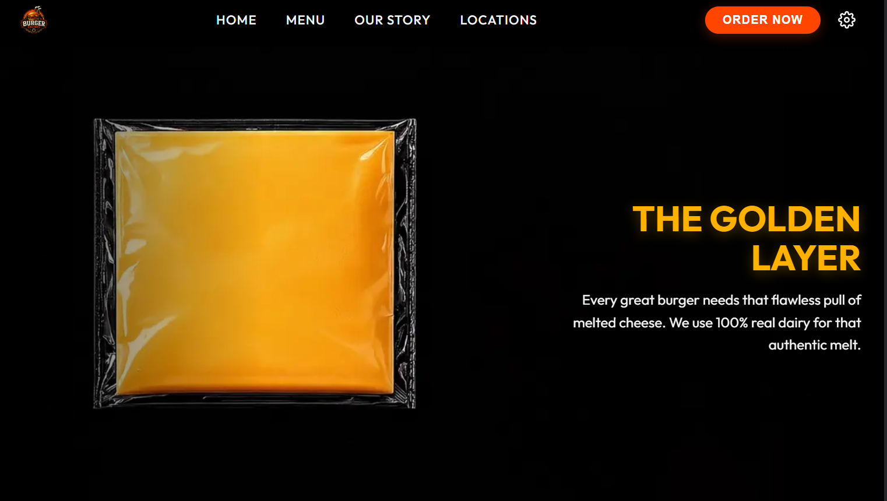
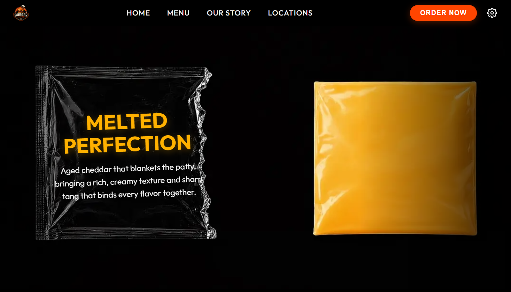
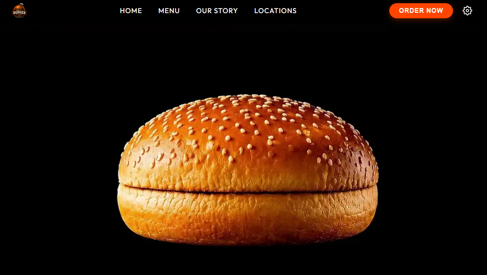
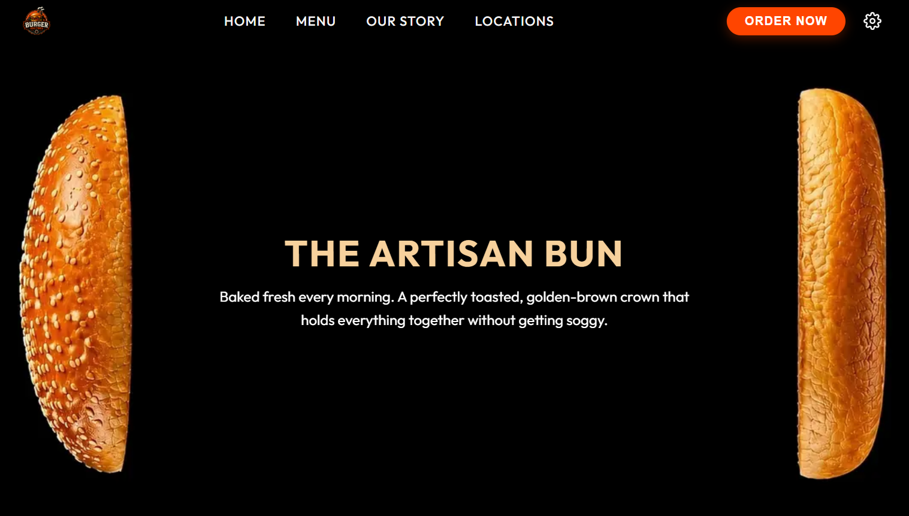

<div align="center">
  

  # The Burger Factory 🍔
  
  **The ultimate taste experience, crafted with passion and the finest code.**
  
  [](https://burgerfactory.vercel.app/)

</div>

---

## 🚀 About The Product

**The Burger Factory** is a hyper-premium, interactive web experience showcasing the assembly of the perfect burger. Unlike traditional static menus, this platform utilizes cinematic scrolling, frame-by-frame canvas animations, and fluid transitions to give users a tantalizing visual journey through each ingredient. 

From the freshly baked bun to the perfectly grilled patty, our digital storefront matches the quality of the burgers we serve.

### ✨ Key Features
- **Cinematic Canvas Animations**: Experience a frame-by-frame 3D-like sequence of a burger assembly as you scroll.
- **GSAP ScrollTrigger**: Complex scroll-linked animations that pin sections and reveal content dynamically.
- **Custom Loading & Splash Screens**: Immersive entry flow ensuring assets are fully pre-loaded for butter-smooth playback.
- **Glassmorphism UI**: Modern aesthetic with blurred backgrounds and high-contrast typography.
- **Fully Responsive**: Flawless experience on both desktop and mobile devices.

---

## 📸 Interactive Journey (Animation Previews)

We designed our sections to come alive as you scroll. Here is a glimpse of our interactive sections before and after the scroll animations trigger.

### 1️⃣ The Hero Experience
Our grand entrance. The burger fully assembles as you scroll down.

| Before Animation | After Animation |
|:---:|:---:|
|  |  |

### 2️⃣ The Perfect Patty
*Freshly grilled, perfectly seasoned.*

<div align="center">
  
</div>

### 3️⃣ Fresh Greens & Cheese
*Crisp lettuce, ripe tomatoes, onions and pickles.*

<div align="center">
  
</div>

### 4️⃣ The Assembly
Watch the layers come together in a mesmerizing sequence.

| Before Animation | After Animation |
|:---:|:---:|
|  |  |

### 5️⃣ The Final Touch
Topped off and ready to be ordered!

| Before Animation | After Animation |
|:---:|:---:|
|  |  |

---

## 🛠️ Tech Stack

- **Framework:** React + Vite
- **Animations:** GSAP (GreenSock Animation Platform) + ScrollTrigger
- **Styling:** Vanilla CSS3 + Variables
- **Deployment:** Vercel

## 💻 Getting Started

To run the project locally and experience the animations firsthand:

1. **Clone the repository:**
   ```bash
   git clone https://github.com/sam-eer31/burger
   cd burger
   ```

2. **Install dependencies:**
   ```bash
   npm install
   ```

3. **Run the development server:**
   ```bash
   npm run dev
   ```

4. **Open in browser:**
   Navigate to `http://localhost:5173`
